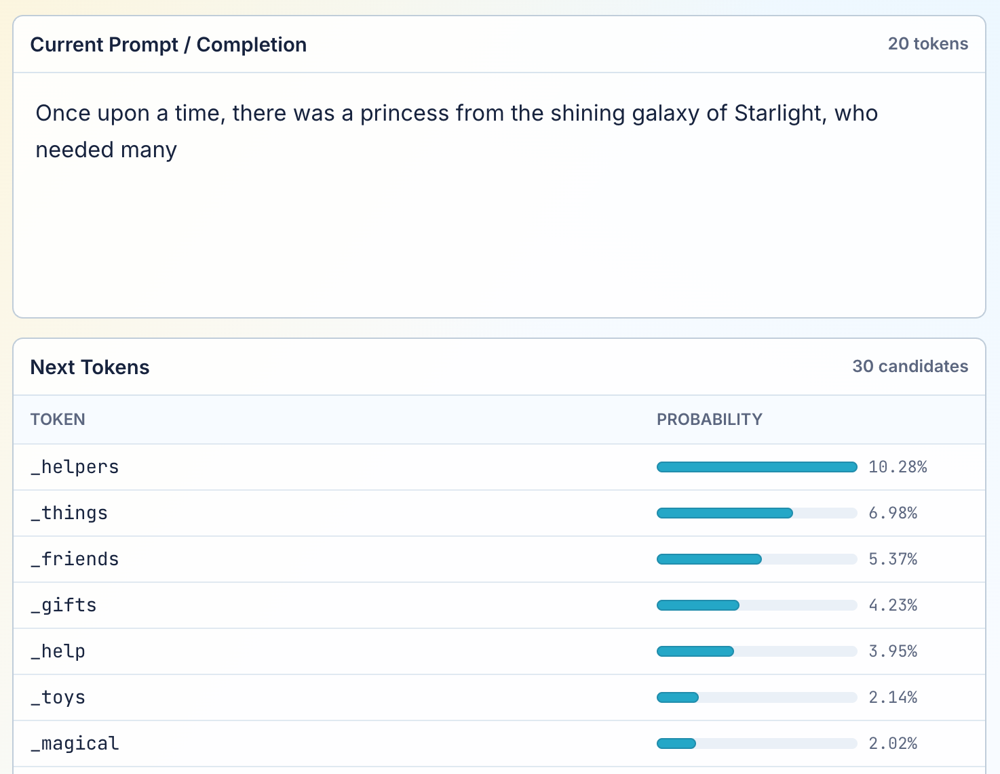

# AI Explorer

AI Explorer is web app for visualising how an AI language model chooses the next token. Try it at [explorer.chatts.net](https://explorer.chatts.net) - Chrome is the most likely browser to work right now, because it uses WebGPU to run the model directly in the browser, rather than rely on any server. (This requires downloading a 250MB model the first time.)

## Keyboard Shortcuts

- `Right arrow` or `Enter`: sample the next token from the visible candidates.
- `Left arrow` or `Backspace`: delete one generated token.
- `Space`: continue sampling tokens.
- `Space` or `Escape`: stop continuing while generation is running.

## Credits

This project was directly inspired by [willkurt/token-explorer](https://github.com/willkurt/token-explorer), which first implemented this idea as a Python terminal app. No code is shared, but the license is preserved from that repo.

The LLM model is [Qwen 2 0.5B](https://huggingface.co/onnx-community/Qwen2.5-0.5B), and the inference is via [transformers.js](https://huggingface.co/docs/transformers.js/index)'s WebGPU support.

## Development

After cloning the repo, first run `npm install`, and then run locally using

    npm run build && (cd dist; python -m http.server)

and viewing at [localhost:8000](http://localhost:8000).
